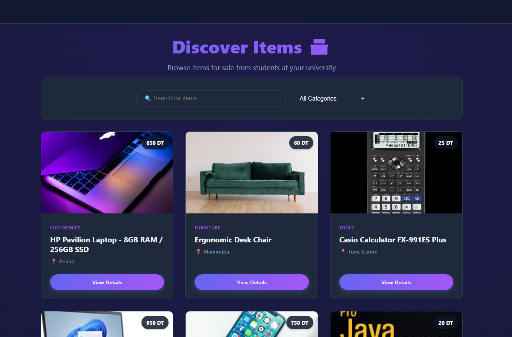
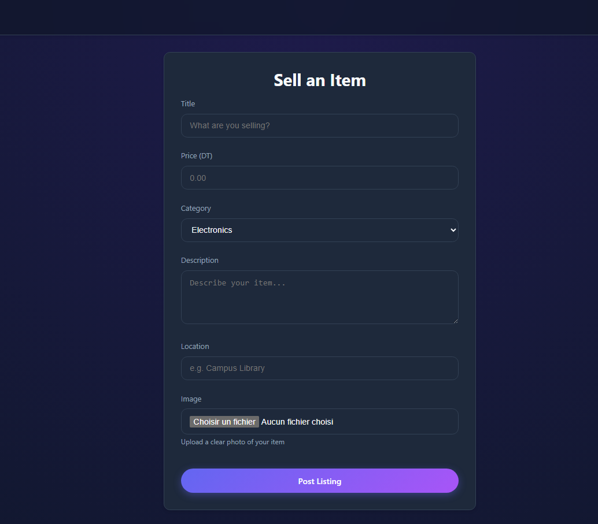
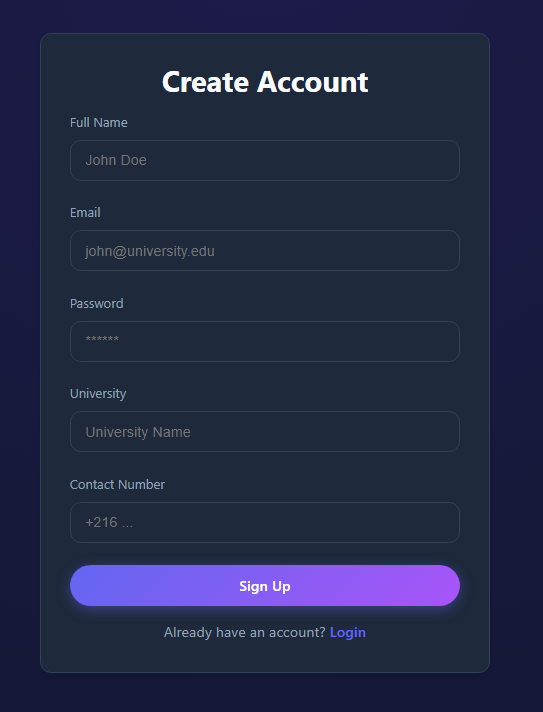
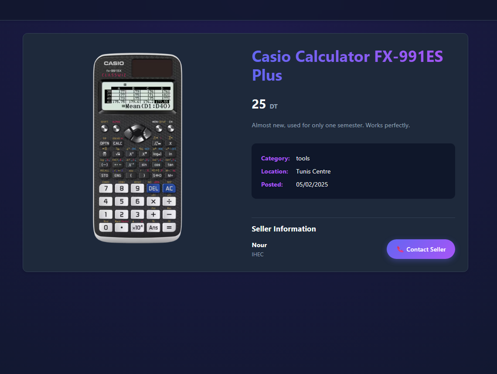

# Uni Marcket

**Uni Marcket** is a full-stack marketplace web application built for university students to buy and sell items within their campus community. The project demonstrates practical skills in frontend/backend separation, authentication, file storage, and real-world app architecture.

This project was developed as a portfolio project to showcase full-stack development skills using modern web technologies.

## Screenshots
## Home Page


## Add Listing


## Auth page


## Product details


These screenshots highlight the main user flow of the application, including browsing listings and creating a new product post.

## Table of Contents

* [Features](#features)
* [Installation](#installation)
* [Usage](#usage)
* [Project Structure](#project-structure)
* [Contributing](#contributing)
* [Technologies Used](#technologies-used)
* [License](#license)
* [Contact](#contact)

## Features

* 🛒 Create, view, and manage product listings
* 🔐 User authentication with Firebase
* 🖼️ Image upload and storage using Supabase
* 👤 Seller information linked automatically to listings
* ⚡ Fast and responsive UI built with React

## Installation

### Prerequisites

* Node.js v14 or higher
* npm

### Steps

```bash
# Clone the repository
git clone https://github.com/alaajaziri/uni_marcket.git
cd uni_marcket

# Install server dependencies
cd server
npm install

# Install client dependencies
cd ../client
npm install
```

## Usage

### Running the Project Locally

You need to run **both the server and the client** in separate terminals.

```bash
# Terminal 1: start the backend server
cd server
npm start
```

```bash
# Terminal 2: start the frontend client
cd client
npm run dev
```

### Getting Started

```bash
# Start the development server
npm start

# Run tests
npm test

# Build for production
npm run build
```

Once the development server is running, open your browser and navigate to:

```
http://localhost:3000
```

## Project Structure

```
uni_marcket/
├── client/
│   ├── public/
│   ├── src/
│   │   ├── api/          # API and service logic
│   │   ├── assets/       # Static assets
│   │   ├── components/   # Reusable UI components
│   │   ├── pages/        # Application pages (routes)
│   │   ├── styles/       # Global styles
│   │   └── App.jsx       # Main application component
│   ├── package.json
│   └── vite.config.js
├── server/
│   ├── controllers/  # Request handlers
│   ├── middleware/   # Custom middleware
│   ├── models/       # Data models
│   ├── routes/       # API routes
│   ├── app.js        # Server entry point
│   └── package.json
└── README.md
```

## Technologies Used

* React

* Node.js

* Firebase Authentication

* Supabase (Database & Storage)

* JavaScript (ES6+)

* CSS

* React

* Firebase Authentication

* Supabase (Database & Storage)

* JavaScript (ES6+)

* CSS

## License

This project is licensed under the MIT License. See the [LICENSE](LICENSE) file for details.

## Contact

**Alaa Jaziri**

* GitHub: [@alaajaziri](https://github.com/alaajaziri)
* Email: [alaa.jaziri1122@example.com](mailto:alaa.jaziri1122@example.com)

## Acknowledgments

* Inspired by student communities and local marketplaces
* Thanks to open-source tools and documentation from Firebase and Supabase
